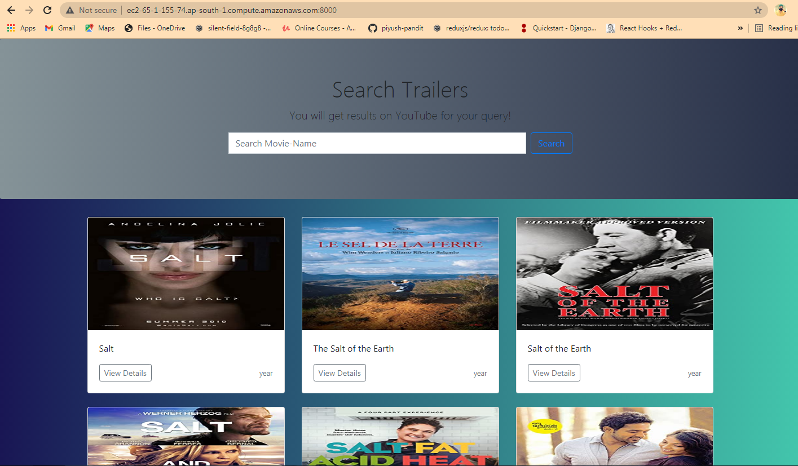

[![LinkedIn][linkedin-shield]][linkedin-url]


<!-- PROJECT LOGO -->
<br />
<p align ="center">
    

  <h3 align ="center">Search_Movie_Trailer</h3>

  <p align ="center">
    An awesome task which allowed me to understand 3rd party API working and make own WebAPI!
    <br />
    <br />
    <a href="http://ec2-65-1-155-74.ap-south-1.compute.amazonaws.com:8000/">View Demo</a>
    ·
    <a href="https://github.com/piyush-pandit/">Report Bug</a>
    ·
    <a href="https://github.com/piyush-pandit/">Request Feature</a>
  </p>
</p>


<!-- TABLE OF CONTENTS -->
## Table of Contents

* [About the Project](#about-the-project)
  * [Built With](#built-with)
* [Getting Started](#getting-started)
  * [Prerequisites](#prerequisites)
  * [Installation](#installation)
* [Usage](#usage)
* [Roadmap](#roadmap)
* [Deployment](#AWS-Deployment)
* [Contributing](#contributing)
* [Contact](#contact)


<!-- ABOUT THE PROJECT -->
## About The Project




This project will help you in searching any related trailers of a movie which you desire and u will be able to watch the trailer and also can read the details and description regarding that movie which will be fetched directly from the official IMDb site. 

Here's why you should love this assignment:
* I am fluent in Django, python applications, learning about an API added a new feather to my cap of Python frameworks.
* Getting to know Funfacts about API's and creating own api was fun and insightful, this is the very first implementation of the same.
* I have used IMDb's api using rapid Api (3rd party) for fetching data of movies and Youtube Api for fetching trailer of the related movies and created a seperate own api to aggregate both the api's and work the functionalities.
* You will find good code quality and code standards which can be used to demonstrate to beginners, if not no issues as we are in an agile world. Learning continously:)


A list of commonly used resources that I find helpful are listed in the acknowledgements.

### Built With
This application is built with love, dedication, coffee and:
* [IMDb](https://rapidapi.com/marketplace)
* [Google cloud api](https://console.cloud.google.com/apis)
* [yotube api](https://developers.google.com/youtube/v3)


<!-- GETTING STARTED -->
## Getting Started

To get a local copy up and running follow these simple example steps.

### Prerequisites


* python and it's Modules
```sh
python 3+
Django==3.1.7
djangorestframework==3.12.4
requests==2.25.1
Pillow==8.1.2
```

### Installation

1. Get an API Key at :-

    for IMDb [https://rapidapi.com/marketplace](https://rapidapi.com/marketplace)  
    for Youtube [https://developers.google.com/youtube/v3](https://developers.google.com/youtube/v3)

2. Clone the repo
```sh
git clone https://github.com/piyush-pandit/Search-Movie-Trailer-.git
```
3. Install python packages
```sh
pip install -r requirements.txt
```

4. Run the application
```python
python manage.py runserver
```


<!-- USAGE EXAMPLES -->
## Usage

_For more examples, please refer to the [Documentation](https://github.com/piyush-pandit/Search-Movie-Trailer-)


<!-- ROADMAP -->
## Roadmap

See the [open issues](https://github.com/piyush-pandit/Search-Movie-Trailer-/issues) for a list of proposed features (and known issues).


<!-- DEPLOYMENT -->
## Deployment

Basic Outline of Deploying on AWS would be be following steps:-
* Step 1: Create a Key Pair. ...
* Step 2: Enter the CodeDeploy Console. ...
* Step 3: Launch a Virtual Machine. ...
* Step 4: Name Your Application and Review Your Application Revision. ...
* Step 5: Create a Deployment Group. ...
* Step 6: Create a Service Role. ...
* Step 7: Deploy Your Application. ...
* Step 8: Clean Up Your Instances.


For detailed installation you can go through this [Link](https://aws.amazon.com/getting-started/tutorials/deploy-code-vm/) or  
You can also watch this video for easy understanding of deployment. [video link](https://youtu.be/lH9bwNvaHww)


<!-- CONTRIBUTING -->
## Contributing

Contributions are what make the open source community such an amazing place to be learn, inspire, and create. Any contributions you make are **greatly appreciated**.

1. Fork the Project
2. Create your Feature Branch (`git checkout -b feature/AmazingFeature`)
3. Commit your Changes (`git commit -m 'Add some AmazingFeature'`)
4. Push to the Branch (`git push origin feature/AmazingFeature`)
5. Open a Pull Request


<!-- CONTACT -->
## Contact

Piyush Pandit - [@an_orthodox_p.p](https://www.instagram.com/an_orthodox_p.p/) - My Instagram  
Piyush Pandit - [piyush-pandit-49b7501ba](https://www.linkedin.com/in/piyush-pandit-49b7501ba/) - My LinkedIn  
Project Link: [https://github.com/piyush-pandit/Search-Movie-Trailer-](https://github.com/piyush-pandit/Search-Movie-Trailer-)  


<!-- MARKDOWN LINKS & IMAGES -->
<!-- https://www.markdownguide.org/basic-syntax/#reference-style-links -->


[linkedin-shield]: https://img.shields.io/badge/-LinkedIn-black.svg?style=flat-square&logo=linkedin&colorB=555
[linkedin-url]: https://www.linkedin.com/in/piyush-pandit-49b7501ba/
[product-screenshot]: images/ui_image.png
